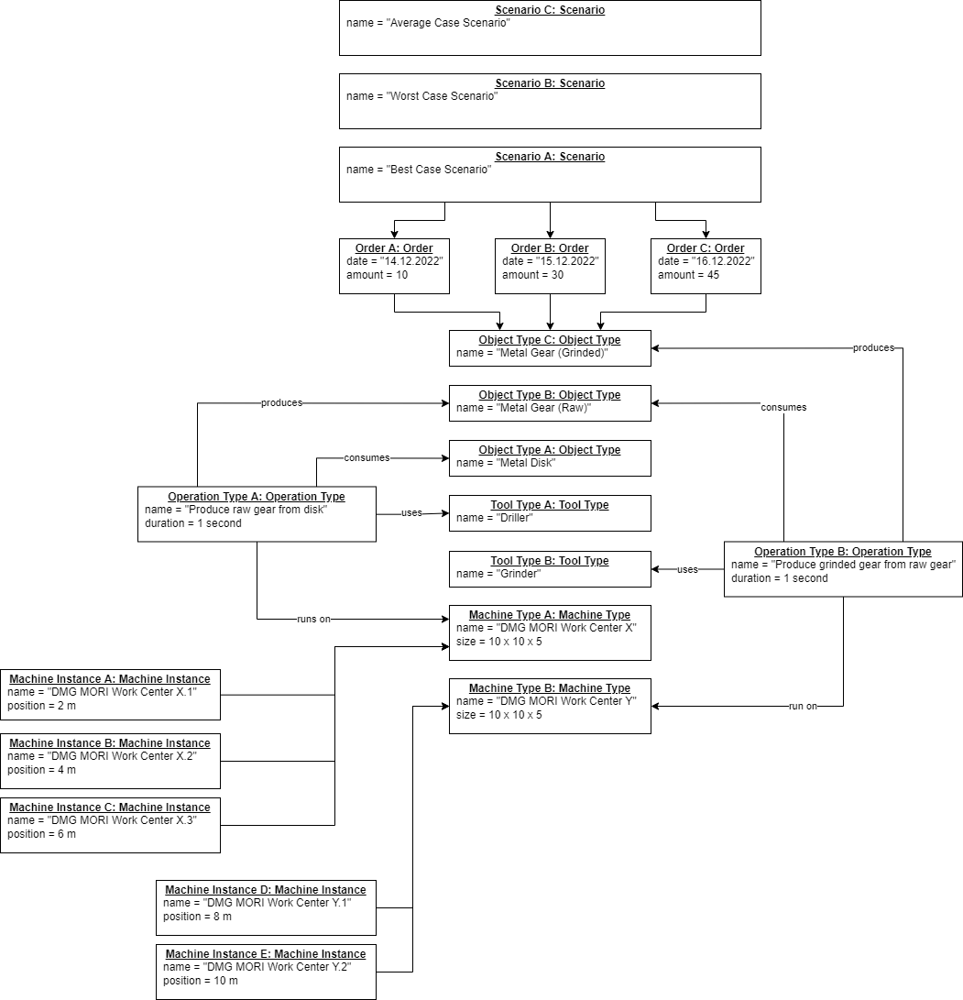

# Factory Design Automation

In this project we study techniques to automate factory design tasks.

## Screenshots

Here are some screenshots of our prototypes:

## Models

Here are some models explaining our overall idea:

### Class Model

The class model describes the entities of factory design:

### Object Model

The object model describes an example factory design:

## Folders

You find more information in the following folders:

* [Concepts](./concepts)
* [Models](./models)
* [Prototypes](./prototypes)
* [Screenshots](./screenshots)