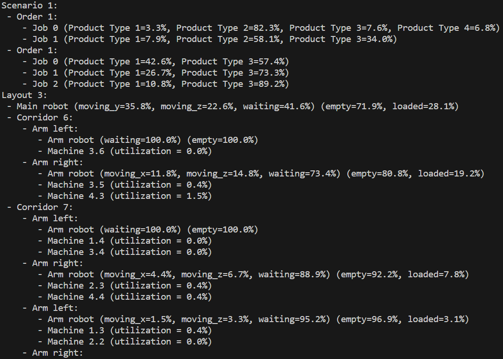
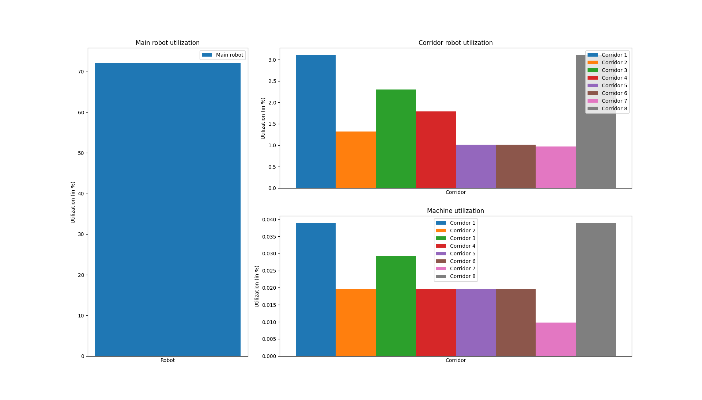

# GridPlant

In this project we study techniques for reducing the effort of modeling and analyzing factory layouts.
To achieve this goal, we develop an easy-to-use configurator and simulator for a particular class of factories.
More precisely, we concentrate on flexible manufacturing systems, which can be adapted to a variety of products and processes.
We assume that the material flow between the work stations of the factory is handled completely by gantry robots.

## Screenshots

Here are some screenshots of our software tool:

### 🖼️ 3D animation

Our software is based on Salabim, a Python framework for Discrete Event Simulation (DES).
DES is a standard tool for factory layout planning and performance evaluation.
Salabim comes with an integrated 3D animation engine, which supports both primitive shapes and Computer-Aided Design (CAD) models in OBJ Wavefront format.


### 🖼️ Performance evaluation

The goal of Discrete Event Simulation (DES) is to evaluate the performance of your factory layout plan early in the planning process.
Performance evaluation typically concentrates on the utilization of resources such as workers, machines, and storage areas.
Our software automatically tracks the most relevant performance characteristics.

#### Console output

The performance data can be printed to the console.



#### PyPlot output

The performance data can be visualized using bar charts.



### 🖼️ Graph visualization

Finally, we support basic graph visualizations for debugging your factory configuration models.
The following graph visualization displays the product types and manufacturing operations of a configuration model.
Product types represent everything from raw material to end products, while operations consume and product them.


## Requirements

To use this project, you need to install the following software packages on your machine.
Note that simulation experiments can be carried out without the optional software packages.

* **Python**
* *Discrete event simulation support*
  * **Salabim**
  * *3D animation support (optional)*
    * PyOpenGL
    * PyOpenGL_accelerate
  * *OBJ Wavefront file format support (optional)*
    * PyWavefront
    * PyGlet
  * *Video production support (optional)*
    * opencv-python
    * numpy
* *Chart visualization support*
  * **Matplotlib**
* *Graph visualization support (optional)*
  * NetworkX

## Examples

**Step 1:** Import the Factory Design Automation (FDA) library.

```python
from fda import *
```

### 👨‍💻 Basic configuration

**Step 2:** Define your product, tool, and machine types.

```python
# Step 2.1: Define your product types
# (everything from raw material to end product)
pt1 = ProductType("Raw material 1", ...)
pt2 = ProductType("End product 1", ...)

# Step 2.2: Define your tool types
# (all types of tools you are using in your production)
tt1 = ToolType(...)

# Step 2.3: Define your machine types
# (all types of machines you are using in your production)
mt1 = MachineType(...)
```

**Step 3:** Define your executable operations.

```python
# Produce PT2 from PT1 on MT1 with TT1
o1 = Operation(..., mt1, tt1, pt1, pt2)
```

### 👨‍💻 Scenario configuraton

**Step 4:** Define your scenarios including orders for product types (see *Basic Configuration*)

```python
# Step 4.1: Define your scenarios
s1 = Scenario(...)
# Step 4.2: Define your orders in the scenarios
o1 = Order(..., pt1, s1)
```

### 👨‍💻 Layout configuration

**Step 5:** Define your factory layouts including corridors, and machines (i.e. instances of machine types).

```python
# Step 5.1: Define your layout variants
l1 = Layout(...)
# Step 5.2: Define your corridors for the layout variants
c1 = Corridor(..., l1)
# Step 5.3: Define your machines for the corridors of the layout variants
m1 = Machine(..., mt1, c1, ...)
```

### 👨‍💻 Performance evaluation

**Step 6:** Evaluate the performance of a layout variant in a given scenario.

```python
# Simulate L1 on S1
simulate(l1, s1)
```

## Models

Here are some models explaining our overall idea:

### 📈 Class model

The class model describes the core entities, which are implemented in our factory design software.
The entities include product types, which represent everything from raw material to end product.
Then, the entities include tool and machine types as well as available manufacturing operations.
On top you define layouts and scenarios.


### 📈 Object model

The object model describes a sample use case.
The use case is concerned with producing metal gears from raw metal disks.
The use case includes milling and grinding as possible operations.
Furthermore, the use case includes two different types machining centers, on which these operations can be executed as well as different order scenarios.

#### First object model


#### Second object model


