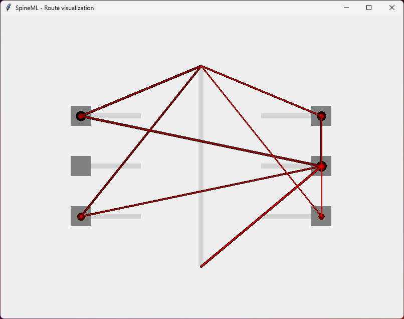
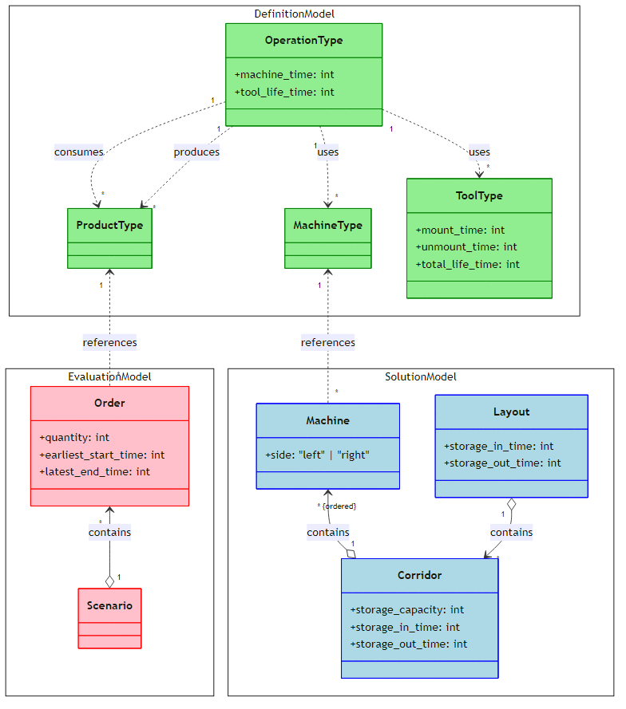
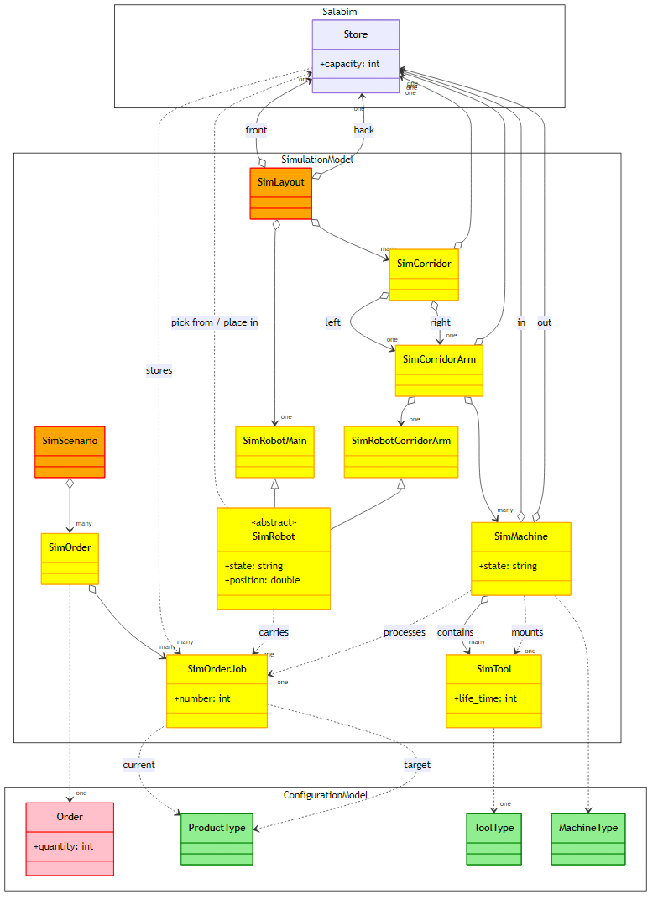

# SpineML

In this project we study techniques for reducing the effort of factory layout planning (FLP) and optimal job shop scheduling (JSS).
To achieve this goal, we develop an easy-to-use configurator and simulator for a particular class of factories.
More precisely, we concentrate on flexible manufacturing systems, which can be adapted to a variety of products and processes.
We assume that the material flow between the work stations of the factory is handled completely by gantry robots.

## 🖼️ Screenshots

Here are some screenshots of our software tool:

- **3D animation** of the factory components including robots and machines
- **Performance evaluation** of the factory layout in a given order scenario
- **Graph visualization** of the underlying factory configuration data model
- **Route visualization** for a given job and a given factory layout

In the following, we explain the software outputs in more detail.

### 3D animation

Our software is based on [Salabim](https://www.salabim.org/), a Python framework for Discrete Event Simulation (DES).
DES is a standard tool for factory layout planning and performance evaluation.
Salabim comes with an integrated 3D animation engine, which supports both primitive shapes and Computer-Aided Design (CAD) models in OBJ Wavefront format.


### Performance evaluation

The goal of Discrete Event Simulation (DES) is to evaluate the performance of your factory layout plan early in the planning process.
Performance evaluation typically concentrates on the utilization of resources such as workers, machines, and storage areas.
Our software automatically tracks the most relevant performance characteristics.

#### Console output

The performance data can be printed to the console.


#### PyPlot output

The performance data can be visualized using bar charts.


### 🖼️ Graph visualization

Furthermore, we support basic graph visualizations for debugging your factory configuration models.
The following graph visualization displays the product types and manufacturing operations of a configuration model.
Product types represent everything from raw material to end products, while operations consume and product them.


### 🖼️ Route visualization

Finally, we provide a visualization of all possible routes through a given layout for a given job.
Note that for a given job at first only the source and the target product type are known.
From this information, the possible sequence of operation types is computed leading from source to target product type.
Finally, from all possible sequences of operation types the possible sequences of machine types can be computed performing these operations.
The goal of optimization is to determine the best sequence of machines for a given job at a given time.



## Requirements

To use this project, you need to install the following software packages on your machine.
Note that simulation experiments can be carried out without the optional software packages.

* **Python**
* *Discrete event simulation support*
  * **Salabim**
  * *3D animation support (optional)*
    * PyOpenGL
    * PyOpenGL_accelerate
  * *OBJ Wavefront file format support (optional)*
    * PyWavefront
    * PyGlet
  * *Video production support (optional)*
    * opencv-python
    * numpy
* *Chart visualization support*
  * **Matplotlib**
* *Graph visualization support (optional)*
  * NetworkX

## 👨‍💻 Examples

When performing a simulation study, we suggest working in four phases:

1. **Basic configuration** defines the products as well as the processes to product them.
2. **Scenario configuration** defines the situations, in which the factory must operate.
3. **Layout configuration** defines the number and arrangement of the factory resources.
4. **Performance evaluation** simulates the performance of the layout in a given scenario.

In the following, we describe each phase in more  detail.

### **Phase 1:** Basic configuration

**Step 1:** Import the Factory Design Automation (FDA) library.

```python
from SpineML import *
```

**Step 2:** Define your product, tool, and machine types.

```python
# Step 2.1: Define your product types
# (everything from raw material to end product)
pt1 = ProductType("Raw material 1", ...)
pt2 = ProductType("End product 1", ...)

# Step 2.2: Define your tool types
# (all types of tools you are using in your production)
tt1 = ToolType(...)

# Step 2.3: Define your machine types
# (all types of machines you are using in your production)
mt1 = MachineType(...)
```

**Step 3:** Define your executable operations.

```python
# Produce PT2 from PT1 on MT1 with TT1
ot1 = OperationType(..., mt1, tt1, pt1, pt2)
```

### **Phase 2:** Scenario configuration

**Step 4:** Define your scenarios including orders for product types (see *Basic Configuration*)

```python
# Step 4.1: Define your scenarios
s1 = Scenario(...)
# Step 4.2: Define your orders in the scenarios
o1 = Order(..., pt1, s1)
```

### **Phase 3:** Layout configuration

**Step 5:** Define your factory layouts including corridors, and machines (i.e. instances of machine types).

```python
# Step 5.1: Define your layout variants
l1 = Layout(...)
# Step 5.2: Define your corridors for the layout variants
c1 = Corridor(..., l1)
# Step 5.3: Define your machines for the corridors of the layout variants
m1 = Machine(..., mt1, c1, ...)
```

### **Phase 4:** Performance evaluation

**Step 6:** Evaluate the performance of a layout variant in a given scenario.

```python
# Simulate L1 on S1
simulate(l1, s1)
```

## 📈 Models

Here are some models explaining our overall idea:

### Configuration model

The configuration model contains the ***design-time* object model** of the application.
The model comprises three submodels, namely a **definition model**, a **solution model**, and an **evaluation model**.
The definition model includes the product type, machine type, tool type, and operation type classes.
The solution model includes the layout, corridor, and machine classes.
The evaluation model includes the scenario and order classes.



### Simulation model

The simulation model contains the ***run-time* object model** of the application, which is based on the configuration model as well as the [Salabim](https://www.salabim.org/) package.
The simulation scenario, order, and order job classes represent the evaluation model elements at run-time.
The simulation layout, corridor, corridor arm, robot main, roboto corridor arm, and machine classes represent the solution model elements at run-time.
The simulation tool class represents a definition model element at run-time.

